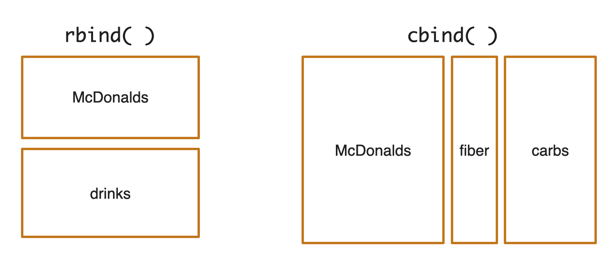
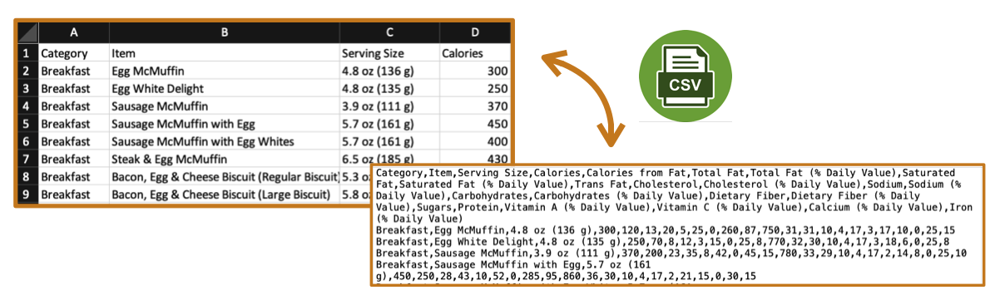
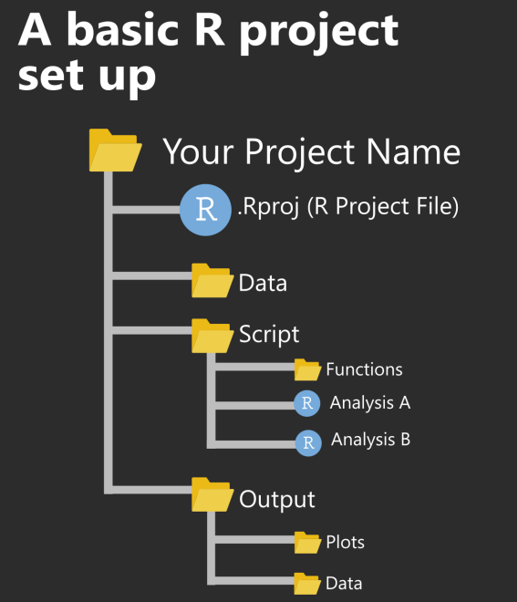

```{r setup, include=FALSE}
library(learnr)
library(tidyverse)
library(ggrepel)

knitr::opts_chunk$set(echo = FALSE)
```


## Learning objectives

This tutorial explains in more detail the syntax, functions, and code you'll be using in the CB201 Quantitative Proteomics assignment. Specifically, this tutorial will cover:

* common R commands
* importing and processing data using tidyverse
* visualizing data using ggplot2 (focusing on generating scatterplots)

<br/>

__Please note, this tutorial is NOT meant to be a comprehensive guide to R.__ If you are interested in learning R, refer to the following resources:

* [Harvard Catalyst online course: Introduction to R](https://catalyst.harvard.edu/courses/intro-to-r/)
* [HSPH Bioinformatics Core workshops](https://bioinformatics.sph.harvard.edu/upcoming-workshops)
  + [Introduction to R self-learning on Github](https://hbctraining.github.io/Intro-to-R-flipped/schedules/links-to-lessons.html)
* [Center for Computational Biomedicine](https://computationalbiomed.hms.harvard.edu/education/)
  + [Introduction to data analysis with R and Bioconductor](https://computationalbiomed.hms.harvard.edu/event/bioconducter-carpentries/) (April 3rd - April 8th, 2023)
  + [Bulk RNA-seq with R/Bioconductor](https://computationalbiomed.hms.harvard.edu/event/bulk-rna-seq-with-r-bioconductor/) (April 10th - April 14th, 2023)

<br/>


## Some basic syntax

### Output text

To output text in R, use single or double quotes. Click on the "Run Code" button below to run code within each code chunk. Compare the outputs from these 2 blocks. Do you see any difference?

```{r output-text1, exercise=TRUE}
"Quantitative proteomics is awesome"
```

```{r output-text2, exercise=TRUE}
'Quantitative proteomics is awesome'
```

<div id="output-text2-hint">
**Note:** Both signle and double quotes can be used to output text in R.
</div>


<br/>


### Output number

To output number, just type the number (without quotes). Run code below.

```{r output-number, exercise=TRUE}
42
```

<br/>

### Add comments

Comments can be used to explain R code. Comments starts with one or more `#`. R will ignore anything that starts with `#`. `#` can also be used to prevent the execution of alternative code when testing.

Run code chunks below and compare the outputs.

```{r add-comments1, exercise=TRUE}
"Quantitative proteomics is awesome"
2+2
3+3
```


```{r add-comments2, exercise=TRUE}
# "Quantitative proteomics is awesome"
# 2+2
3+3           # Comment at the end of a line of code
```


<div id="add-comments2-hint">
**Note:** Because of `#`, R only calculates 3+3 in this code block.
</div>


<br/>


## Some common R commands (Part 1)

### Perform calculations

At a basic level, we can use R much as we would use a calculator. Here is a list of arithmetic operator available in R.

| Operator | Description |
|:--------:|:------------|
| +        | Addition    |
| -        | Subtraction |
| *        | Multiplication |
| /        | Division    |
| ^        | Exponent    |
| %%       | Remainder from division |
| %/%      | Integer division |

```{r addition, exercise=TRUE}
# Add 42 and 23
42 + 23
```

<br/>

Your turn: try some of additional arithmetic operators. _Hint: You can type directly into the code chunk below._ 

```{r calculation, exercise=TRUE}

```

<br/>


### Compare values

Relational operators are used to compare between values. Here is a list of relational operators in R:

| Operator | Description |
|:--------:|:------------|
| <        | Less than   |
| >        | Greater than |
| <=       | Less than or equal to |
| >=       | Greater than or equal to |
| ==       | Equal to    |
| !=       | Not equal to |

```{r equal-to, exercise=TRUE}
# Is 42 equal to 23?
42 == 23
```

<br/>

Your turn: try some of the relational operators.

```{r compare, exercise=TRUE}

```

<br/>

### Perform logical operations

Logical operators are used to carry out Boolean operations like AND, OR etc.

| Operator | Description |
|:--------:|:------------|
| !        | NOT         |
| &        | AND (TRUE when both sides are TRUE) |
| \|       | OR (TRUE when either side is TRUE) |

```{r and, exercise=TRUE}
# AND operator
(42 > 23) & (6 == 5) 
```

<div id="and-hint">
**Note:** (42 > 23) is TRUE; (6 == 5) is FALSE. For AND operator to be TRUE, arguments on both sides need to be TRUE. Thus, the output for `(42 > 23) & (6 == 5)` is FALSE.
</div>

<br/>

Your turn: What's your prediction for the following code chunk? Is it going to be same as the previous?

```{r or, exercise=TRUE}
# AND operator
(42 > 23) | (6 == 5) 
```

<div id="or-hint">
**Note:** Again, (42 > 23) is TRUE; (6 == 5) is FALSE. OR operator is true as long as one argument on either side is TRUE. Thus, the output for `(42 > 23) | (6 == 5)` is TRUE
</div>


<br/>

Your turn: try some of the logical operators.

```{r logical, exercise=TRUE}

```

<br/>


### A quick note on functions

A function is a set of code organized to perform certain tasks. It takes input arguments and produces outputs by executing built-in R commands inside the function. R has a large number of built-in functions and the user can create their own functions. For more info, watch this 4 min video on [functions](https://vimeo.com/429606516).

The following code chunks showcase a few basic functions:

```{r function1, exercise=TRUE}
log10(100)            ## log base 10              
```

```{r function2, exercise=TRUE}
exp(3)                ## e raised to a certain power
```

```{r function3, exercise=TRUE}
abs(-10)              ## absolute value
```

```{r function4, exercise=TRUE}
sqrt(1764)            ## square root
```

<br/>

If you'd like more info on any function, use `help()` or `?`. Try running the following code chunks to find more info on the functions `log10()` and `abs()`.

```{r function-help1, exercise=TRUE}
help(log10)
```

```{r function-help2, exercise=TRUE}
?abs
```

<br/>


## Some common R commands (Part 2)

### Create variables

Variables are containers for storing data values. To assign a value to a variable use `<-` or `=`

Note: A variable name must start with a letter and can be a combination of letters, digits, period(.) and underscore(_). Variable names are case-sensitive.

```{r create-variable1, exercise=TRUE}
# Create some variables
name <- "John"
name <- "Doe"             ## Variable can be easily overwritten
age <- 40
```

<div id="create-variable1-hint">
**Hint:** Clicking on the "Run Code" button will run this code chunk and define the variables in the background. Run the next code chunk to print out the variables.
</div>

```{r create-variable2, exercise=TRUE, exercise.setup = "create-variable1"}
# Print variables
name
age
```

<div id="create-variable2-hint">
**Hint:** `name` has been overwritten from "John" to "Doe" in the previous code chunk.
</div>


<br/>


### Data types

Variable can store data of different types. Common data types include:

* __Numeric__: 42, 2.3, 7891752, -120
* __Character (aka string)__: “x”, “CB201 is so cool”, “FALSE”, “11.5”
* __Logical (aka Boolean)__: TRUE or FALSE

Note, there are other data types. We will not discuss those in this tutorial because they are beyond the scope of EA2.

```{r datatype, exercise=TRUE, exercise.setup = "create-variable1"}
# Check the data type of a variable using the function class()
class(name)
class(age)
```

<br/>


### Data structure - vector

You will be working with 2 common data structures in EA2: __vector__ and __data frame__. There are other data structures. We will not discuss those in this tutorial because they are beyond the scope of EA2.

__Vector__ is the most basic data structure in R. They are often defined using `c()`. `c` stands for concatenate, aka put these together as a vector. Vector must contain elements of the same data type.

```{r vector-setup, exercise=TRUE}
# A character vector
item <- c("Egg McMuffin", "Sausage McMuffin", "Baked Apple Pie", "Chocolate Chip Cookie")

# Numeric vectors
calories <- c(300, 370, 250, 160)
fat <- c(13, 23, 13, 8)
protein <- c(17, 14, 2, 2)

# A logical vector
meat <- c(TRUE, TRUE, FALSE, FALSE)
```

<br/>

Your turn: try printing each of the vectors defined above. Note, you have to run the previous code chunk prior to printing them below.

```{r vector-print, exercise=TRUE, exercise.setup = "vector-setup"}

```

<br/>

Note, the following functions are useful for creating a sequence of numbers. Remember, if you'd like more info about any function, use `help()` or `?`.

```{r sequcence1, exercise=TRUE}
# Use the : operator
0:20
20:0
```

```{r sequcence2, exercise=TRUE}
# Use the seq( ) function
seq(from = 0, to = 20)
seq(from = 0, to = 20, by = 2)
```

```{r sequcence3, exercise=TRUE}
# Use the rep( ) function
rep(1, times = 5)
rep(c(0, 1, 2), times = 5)
rep(c(0, 1, 2), each = 5)
```

<br/>

### Some useful functions

R has a number of built-in functions for data analysis. Let's use the vectors we have set up to explore what these functions do.

| Function | Description |
|:--------:|:------------|
| length() | number of values |
| max()    | max |
| min()    | min |
| sum()    | sum |
| median() | median |
| mean()   | mean |
| var()    | variance |
| sd()     | standard deviation |

```{r functions, exercise=TRUE, exercise.setup = "vector-setup"}
# Recall previously defined vector
calories

# Find the mean of all values in Calories
mean(calories)
```

Your turn: try out some of the functions on our pre-defined vectors

```{r functions2, exercise=TRUE, exercise.setup = "vector-setup"}

```

<br/>


### Data structure - data frame

A __data frame__ is used for storing data tables; it’s a list of vectors of equal length. Data frame can include columns of any data types.

```{r dataframe-creation, exercise=TRUE, exercise.setup = "vector-setup"}
# Remember we previously defined several vectors
item <- c("Egg McMuffin", "Sausage McMuffin", "Baked Apple Pie", "Chocolate Chip Cookie")
calories <- c(300, 370, 250, 160)
fat <- c(13, 23, 13, 8)
protein <- c(17, 14, 2, 2)
meat <- c(TRUE, TRUE, FALSE, FALSE)

# Create a data frame with previously defined vectors
McDonalds <- data.frame(Item = item, 
                        Calories = calories, 
                        Fat = fat, 
                        Protein = protein, 
                        Meat = meat)

# Print data frame. 
# Notice: the column names are Item, Calorie, Fat, Protein, and Meat. 
# These columns store values from our previously defined vector
McDonalds
```

<br/>

We can access single columns in a data frame using the `$`. This returns the column as a vector.

```{r dataframe-subset1, exercise=TRUE, exercise.setup = "dataframe-creation"}
# Pull out the Item column from the McDonalds data frame
McDonalds$Item
```

<br/>

We can also access one or multiple rows or columns using `df[x,y]` notation, where x specifies the row(s) you want and y specifies the column(s). For example:

```{r dataframe-subset2, exercise=TRUE, exercise.setup = "dataframe-creation"}
# Pull out the column named "Fat"
McDonalds[ , "Fat"] 
```

```{r dataframe-subset3, exercise=TRUE, exercise.setup = "dataframe-creation"}
# Pull out the row 1, 3, and 4
McDonalds[c(1, 3, 4) , ] 
```

```{r dataframe-subset4, exercise=TRUE, exercise.setup = "dataframe-creation"}
# The df[x, y] notation can also be used to exclude rows and/or columns.
# For example, to exclude row 3
McDonalds[-3 , ] 
```

<br/>


In EA2, you will be asked to join data frames.

* `rbind( )` can be used to add/join rows
* `cbind( )` can be used to add/join columns

In the following set of code chunks, we will use `rbind( )` to add a few more entries to the McDonalds data frame. We will then use `cbind()` to add a few more columns with nutrition info to the McDonalds data frame. See diagram below:


{width=90%}

```{r rbind2, exercise=TRUE, exercise.setup = "dataframe-creation"}
# Define a drinks vector
drinks <- data.frame(Item = c("Iced Tea", "Hot Chocolate", "Regular Iced Coffee") ,
                     Calories = c(0, 440, 190),
                     Fat = c(0, 16, 7),
                     Protein = c(0, 14, 1),
                     Meat = rep(FALSE, times = 3))

# Use rbind() to add the drinks data frame as new rows to the McDonalds data frame 
McDonalds <- rbind(McDonalds, drinks)
McDonalds
```

```{r cbind1, exercise=TRUE, exercise.setup = "rbind2"}
# Define a Fiber vector
fiber <- c(4, 4, 4, 1, 0, 1, 0)

# Use cbind() to add the fiber vector as a new column to the McDonalds data frame 
McDonalds <- cbind(McDonalds, Fiber = fiber)
McDonalds
```


```{r cbind2, exercise=TRUE, exercise.setup = "cbind1"}
# Define a carbs data frame
carbs <- data.frame(Carbohydrates = c(31, 29, 32, 21, 0, 61, 31),
                    Sugars = c(3, 2, 13, 15, 0, 56, 30))

# Use cbind() to add the carbs data frame as new columns to the McDonalds data frame
McDonalds <- cbind(McDonalds, carbs)
McDonalds
```

<br/>


### Some useful functions for working with data frames

R has a number of useful functions for working with data frames

```{r function-dataframe, exercise=TRUE, exercise.setup = "cbind2"}
# Find number of rows in data frame
nrow(McDonalds)

# Find number of columns in data frame
ncol(McDonalds)

# Find dimensions of data frame
dim(McDonalds)
```

<br/>


## Import and process data

### Packages in R and Tidyverse

Packages are the units of reproducible R code. They include R functions, the documentation that describes how to use those functions, and sample data. By default, R installs a set of packages during installation. Others need to be installed and loaded prior to use. These packages are available for download from [CRAN](https://CRAN.R-project.org/) and other repositories such as [Bioconductor](https://www.bioconductor.org/).

* To install packages use code such as `install.packages("readxl")`. 
* To load packages use code such as `library(readxl)`.
* To check out what packages are installed already use `installed.packages()`.
* To check if any packages need updating use `old.packages()`.

In EA2, we'll be using [Tidyverse](https://www.tidyverse.org/). Tidyverse is a collection packages useful for data science. In particular, we will use the packages `dplyr` and `ggplot2` from `tidyverse`for data processing and data visualization, respectively.


<br/>

### Importing data

Comma-separated file (.csv file) is one of the most commonly used  file formats for data storage in the biological/biomedical sciences. csv files store tabular data (number and text) in plain text. It use comma to separate values (see figure below).

{width=90%}

<br/>

There are multiple ways to read import data for analysis:

* The built-in `read.csv()` function read in a .csv file as a data frame
* `read_csv()` function from the `tidyverse` suite of packages offers more functionality
* `read_excel()` function from the `readxl` package reads in Excel files

The following code chunk uses `read.csv()` followed by a relative file path to read in the full McDonalds Menu from a csv file. This data set was adapted from Kaggle dataset: [Nutrition Facts for McDonald's Menu](https://www.kaggle.com/datasets/mcdonalds/nutrition-facts). It contains the nutritional value of items on McDonald's menu.

```{r import, exercise=TRUE}
McDonalds_FullData <- read.csv("data/McDonalds_menu.csv")
```

<br/>


### Inspecting data

In the following code chunks, we will be working with the data frame `McDonalds_FullData`. **Note, to work with this data frame, make sure you have imported it in the previous section.** Let's start with inspecting this data frame...

Previously, we looked at `nrow()`, `ncol()`, `dim()`. Try using these functions to figure out the number of rows, the number of columns, and the dimension of `McDonalds_FullData`.

```{r inspect-data1, exercise=TRUE, exercise.setup = "import"}

```

<div id="inspect-data1-hint">
**Hint:** number of rows = 260, number of columns = 24, dimension = 260 x 24
</div>


<br/>

Other useful functions for inspecting data:

| Function | Description |
|:--------:|:------------|
| head()   | return first parts of data frame |
| tail()   | return last parts of data frame |
| str()    | compactly look at the structure of data frame |
| glimpse() | from dplyr package, get a glimpse of data frame |
| summary() | get quick statistics of columns |

Now, it's your turn to try out a few of these functions. Please feel free to edit the code chunk below.

```{r inspect-data2, exercise=TRUE, exercise.setup = "import"}
glimpse(___)
```


<br/>

### Processing data

Pipes, `%>%`, allows the output of a previous command to be used as the input of another command, rather than using nested functions. This can make code more human readable. Compare the outputs from the following 2 code chunks:

```{r pipe1, exercise=TRUE}
round(sqrt(95), digit = 1)           ## use nested functions
```

```{r pipe2, exercise=TRUE}
sqrt(95) %>% round(digit = 1)        ## use %>%
```

<br/>


`%>%` is often used to string together multiple functions from the `dplyr()` package used for data wrangling. These functions include: 

| Function | Description |
|:--------:|:------------|
| filter() | pick rows based on certain condition(s) |
| select() | extracts (and optional renames) variables |
| rename() | changes the name of variables |
| mutate() | add new variables that are derived from existing variables |
| arrange() | orders rows by values of selected variable |
| group_by() | groups data frame by values of variable(s) for subsequent operation(s) |
| summarise() | reduces multiple values down to a single summary (e.g., mean) |

Your turn: try figure out what the following lines of code is trying to achieve:

```{r wrangle, exercise=TRUE, exercise.setup = "import"}
McDonalds_FullData %>%
  select(Category, Item, Calories, Calories.from.Fat) %>% 
  filter(Calories != 0) %>%
  rename(FatCalories = Calories.from.Fat) %>% 
  mutate(PercentFatCalories = FatCalories / Calories * 100) %>%
  group_by(Category) %>%
  summarise(MeanPercent = mean(PercentFatCalories)) %>%
  arrange(desc(MeanPercent))
```

<div id="wrangle-hint">
**Hint:** Calculate the average % of total calorie from fat for different categories and arrange the output in descending order (items with 0 calories were excluded from analysis).
</div>

<br/>


## Visualize data using ggplot2

`ggplot2` is a dedicated package for data visualization. Every graph in ggplot2 is built using at least three components:

* __data__: data set for graphing
* __aesthetics__: variables _mapped_ to x or y positions and aesthetics attributes such as color, shape, or size
* __geometries__: way of displaying data (e.g., bars, points, lines)

```
ggplot(data = <DATA>, mapping = aes(<MAPPINGS>)) +  
  <GEOM_FUNCTION>()
```

Using the `+` operator, we can build upon a basic `ggplot2` graph and define/modify different elements including:

* __scale__: map data values to visual values of an aesthetic
* __theme__: adjust graphic background, axis, grid, etc
* __labeling__: add/modify graphic title, subtitle, caption, legend, etc
* __statistics__: transform data for graphing (e.g., graph mean, median, etc)
* __facets__: display subsets of data 
* __coordinates__: transform axis

For more adjustments you can make with ggplot2, see [ggplot2 documentation](https://ggplot2.tidyverse.org/reference/index.html) or [cheatsheet](https://posit.co/wp-content/uploads/2022/10/data-visualization-1.pdf)

<br/>


### Build a basic scatter plot

Now, let's build a scatter plot to show the relationship between Calories and Protein of items in `McDonalds_FullData`. Note, for all exercises on this page, `McDonalds_FullData` has been pre-loaded for you.

```{r ggplot1, exercise=TRUE, exercise.setup = "import"}
ggplot(data = McDonalds_FullData,                      # data
       mapping = aes(x = Calories, y = Protein)) +     # mappings to aesthetics
  geom_point()                                         # geom function
```

<br/>


### Add color and specify shape and size of dots

Assume we want to color dots by category (e.g., Breakfast, Salads, etc), use empty circles for graphing (preferred when dots overlap), and specify shape and size of of the dots. We can achieve all of these by adjusting the code used to to build the basic dot plot above. Compare the code chunk below to the one above. What do you think each of the newly added argument is doing?

```{r ggplot2, exercise=TRUE, exercise.setup = "import"}
ggplot(data = McDonalds_FullData,
       mapping = aes(x = Calories, y = Protein, color = Category)) +
  geom_point(shape = 21, size = 1.5)
```

<div id="ggplot2-hint">
**Hint:** Look up the documentation for `geom_point()` for all the changes you can make to the dot plot.
</div>

<br/>


### Adjust axis range and location of tick marks

We can use the `+` operator to add layers and define/modify different elements of a graph. Assume we want to adjust x-axis so it starts at 0, ends at 2000, with tick marks every 500. We can achieve this by adding one line of code:

```{r ggplot3, exercise=TRUE, exercise.setup = "import"}
ggplot(data = McDonalds_FullData,
       mapping = aes(x = Calories, y = Protein, color = Category)) +
  geom_point(shape = 21, size = 1.5) +
  scale_x_continuous(limits = c(0, 2000), 
                     breaks = seq(from = 0, to = 2000, by = 500))
```

<br/>

Your turn: Assume we want to adjust x-axis so it starts at 0, ends at 100, with tick marks every 25. Complete the code chunk below to achieve this.

```{r ggplot4, exercise=TRUE, exercise.setup = "import"}
ggplot(data = McDonalds_FullData,
       mapping = aes(x = Calories, y = Protein, color = Category)) +
  geom_point(shape = 21, size = 1.5) +
  scale_x_continuous(limits = c(0, 2000), 
                     breaks = seq(from = 0, to = 2000, by = 500)) +
  ___
```


```{r ggplot4-solution}
ggplot(data = McDonalds_FullData,
       mapping = aes(x = Calories, y = Protein, color = Category)) +
  geom_point(shape = 21, size = 1.5) +
  scale_x_continuous(limits = c(0, 2000), 
                     breaks = seq(from = 0, to = 2000, by = 500)) +
  scale_y_continuous(limits = c(0, 100), 
                     breaks = seq(from = 0, to = 100, by = 25))
```

<br/>


### Use built-in themes

We can use themes built-in to ggplot to change the display of a graph. See a list of `ggplot2` themes [here](https://ggplot2.tidyverse.org/reference/ggtheme.html#ref-examples).

Your turn: Add `theme_bw()` to the graph we have been building. What differences do to do you see between the graph with `theme_bw()` to those without?

```{r ggplot5, exercise=TRUE, exercise.setup = "import"}
ggplot(data = McDonalds_FullData,
       mapping = aes(x = Calories, y = Protein, color = Category)) +
  geom_point(shape = 21, size = 1.5) +
  scale_x_continuous(limits = c(0, 2000), 
                     breaks = seq(from = 0, to = 2000, by = 500)) +
  scale_y_continuous(limits = c(0, 100), 
                     breaks = seq(from = 0, to = 100, by = 25)) +
  ___
```


```{r ggplot5-solution}
ggplot(data = McDonalds_FullData,
       mapping = aes(x = Calories, y = Protein, color = Category)) +
  geom_point(shape = 21, size = 1.5) +
  scale_x_continuous(limits = c(0, 2000), 
                     breaks = seq(from = 0, to = 2000, by = 500)) +
  scale_y_continuous(limits = c(0, 100), 
                     breaks = seq(from = 0, to = 100, by = 25)) +
  theme_bw()
```

<br/>


### Add/Adjust labels

To add/adjust labels, we can add a `labs()` layer.

Your turn: We want make the graph more informative by changing the x-axis label to "Calories (Cal)", y-axis label to "Protein (g)", and title to "Protein and Calorie of Items on McDonald's Menu". Look at the documentation for `labs` and figure out how you would achieve this. 

```{r ggplot6, exercise=TRUE, exercise.setup = "import"}
ggplot(data = McDonalds_FullData,
       mapping = aes(x = Calories, y = Protein, color = Category)) +
  geom_point(shape = 21, size = 1.5) +
  scale_x_continuous(limits = c(0, 2000), 
                     breaks = seq(from = 0, to = 2000, by = 500)) +
  scale_y_continuous(limits = c(0, 100), 
                     breaks = seq(from = 0, to = 100, by = 25)) +
  theme_bw() +
  ___
```


```{r ggplot6-solution}
ggplot(data = McDonalds_FullData,
       mapping = aes(x = Calories, y = Protein, color = Category)) +
  geom_point(shape = 21, size = 1.5) +
  scale_x_continuous(limits = c(0, 2000), 
                     breaks = seq(from = 0, to = 2000, by = 500)) +
  scale_y_continuous(limits = c(0, 100), 
                     breaks = seq(from = 0, to = 100, by = 25)) +
  theme_bw() +
  labs(x = "Calories (Cal)", y = "Protein (g)", 
       title = "Protein and Calorie of Items on McDonald's Menu")
```

<br/>


### Highlight data points in a scatter plot

Looking at the scatter plot above, we see that there is one outlier. In this section, we will highlight that outlier and add a label. We will:

1. create a data frame with just the outlier 
2. use `McDonalds_FullData` and `outlier` to generate the graph, and color the outlier red
3. use `geom_text_repel()` from the `ggrepel` package to label the outlier with its item name

Compare the code chunk below with the code chunk above -- what new lines of code do you see? What do you think their functions are?

```{r ggplot7, exercise=TRUE, exercise.setup = "import"}
# Filter for outlier
outlier <- McDonalds_FullData %>% 
  filter(Protein > 75)

# Adjust colors to highlight the outlier and add a label
ggplot(data = McDonalds_FullData,
       mapping = aes(x = Calories, y = Protein)) +
  geom_point(shape = 21, size = 1.5, color = "grey51") +
  geom_point(data = outlier, 
             shape = 21, size = 1.5, color = "indianred4", fill = "indianred1") +
  geom_text_repel(data = outlier, mapping = aes(label = Item),
                  size = 3, segment.size = 0.2, nudge_x = -20, nudge_y = 5) +
  scale_x_continuous(limits = c(0, 2000), 
                     breaks = seq(from = 0, to = 2000, by = 500)) +
  scale_y_continuous(limits = c(0, 100), 
                     breaks = seq(from = 0, to = 100, by = 25)) +
  theme_bw() + 
  theme(panel.grid.minor = element_blank()) +
  labs(x = "Calories (Cal)", y = "Protein (g)",
       title = "Protein and Calorie of Items on McDonald's Menu")
```


<div id="ggplot7-hint">
`geom_point(data = outlier, shape = 21, size = 1.5, color = "indianred4", fill = "indianred1")` color codes the outlier red. 
`geom_text_repel(data = outlier, mapping = aes(label = Item), size = 3, segment.size = 0.2, nudge_x = -20, nudge_y = 5)` labels the outlier with its item name.
</div>


<br/>

Your turn: try highlighting all menu items that contain chicken.

```{r ggplot8, exercise=TRUE, exercise.setup = "import"}
# Hint: str_detect() can be used to find certain text patterns
chicken <- McDonalds_FullData %>%
  filter(str_detect(string = Item, pattern = "Chicken"))

# Your turn: highlight chicken containing items

```


```{r ggplot8-solution}
ggplot(data = McDonalds_FullData,
       mapping = aes(x = Calories, y = Protein)) +
  geom_point(shape = 21, size = 1.5, color = "grey51") +
  geom_point(data = chicken, 
             shape = 21, size = 1.5, color = "indianred4", fill = "indianred1") +
  geom_text_repel(data = McDonalds_FullData %>% filter(Protein > 75), 
                  mapping = aes(label = Item),
                  size = 3, segment.size = 0.2, nudge_x = -20, nudge_y = 5) +
  scale_x_continuous(limits = c(0, 2000), 
                     breaks = seq(from = 0, to = 2000, by = 500)) +
  scale_y_continuous(limits = c(0, 100), 
                     breaks = seq(from = 0, to = 100, by = 25)) +
  theme_bw() + 
  theme(panel.grid.minor = element_blank()) +
  labs(x = "Calories (Cal)", y = "Protein (g)",
       title = "Protein and Calorie of Items on McDonald's Menu")
```


<br/>

### Exporting your plot

Use `ggsave()` function to export your plot. It defaults to saving the last plot that you displayed. It also allows you to specify different parameters of the plot. For example:

```
ggsave(filename = "McDonalds_ProteinVsCalorie.jpg", 
       bg = "white", width = 6, height = 4, units = "in", dpi = 300)
```


### Quick notes about interactive visualization

In EA2, you will also create interactive visualization. Specifically, you will use the following packages:

* `plotly` is a open-source library for developing interactive visualizations. It provides a number of “standard” interactions (pop-up labels, drag to pan, select to zoom, etc) automatically. Moreover, it is possible to take a `ggplot2` plot and wrap it in Plotly in order to make it interactive.
* `htmlwidgets` provides a way to utilize a number of JavaScript interactive visualization libraries. JavaScript is the programming language used to create interactive websites (HTML files), and so is highly specialized for creating interactive experiences.

Detailed description of these packages is beyond the scope of this tutorial.

<br/>


## A few notes about reproducibility

A data analysis is reproducible if all the information (data, files, etc.) required is available for someone else to re-do the entire analysis. This often means the following should be available

1. The data
2. All steps for cleaning the raw data (including the code used) in preparation for analysis
3. All code and software (specific versions, packages) used for analysis


This sections list a few recommendations for making your data analysis more reproducible. This list is by no means exhaustive. For more on this topic, refer to [Reproducible Research with R & RStudio](http://christophergandrud.github.io/RepResR-RStudio/) by Christopher Gandrud. 

<br/>

### Create self-contained projects

Organize each data analysis project in a folder on your computer that holds all the relevant files for that project (input data, R script, analytically results, figures, etc). Also, consider how you structure this folder. Is it structured in a way that helps your collaborators - including a future version of yourself – to navigate the analysis easily? A basic R project set up could be as follows (Image derived from Martin Chan's Blog by [Martin Chan](https://martinctc.github.io/blog/rstudio-projects-and-working-directories-a-beginner's-guide/))

{width=35%}
<br/>

You may have noticed that the first file within "Your Project Name" folder is an RStudio Project file (.Rproj). Creating and using .Rproj ensures that your working directory points to the root folder where that .Rproj file is saved and avoids issues that might arise with using an full absolute path. Read [this blog](https://martinctc.github.io/blog/rstudio-projects-and-working-directories-a-beginner's-guide/) for more info on file path referencing with RStudio Projects.

<br/>

### Use RMarkdown/Quarto

EA2 uses RMarkdown. R Markdown weaves together narrative text and code, improving the readability/reproducibility of your code. At the click of a button, or the type of a command, you can rerun the code in an R Markdown file to reproduce your work and export the results as a finished report. In the last step of EA2, you will "Knit" your document to create a html report for submission.

Note, Posit (formally RStudio) recently launched [Quarto](https://quarto.org/). Quarto is marketed as a next generation version of R Markdown, with many new features and capabilities. Of note, one major feature of Quarto is that it's language-agnostic. It can render documents that contain code written in R, Python, Julia, or Observablem, making it very useful if you work with people who write in a different programming language.

<br/>

### Include a timestamp and session info

Code is provided in the last step of EA2 to add a timestamp and session info. These are important information to document for any analysis. In particular, `sessionInfo()` summarizes your R environment and makes it easy to check the version of packages you used for the analysis.

<br/>

